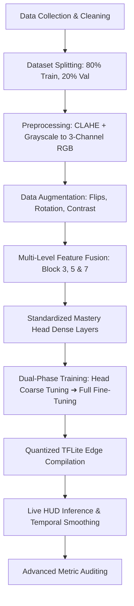

# 💎 Strategic Mastery: EfficientNet-B0 End-to-End Project Summary
## ORIEN Neural Synergy (V2.0 - Production Grade)

This document provides an end-to-end deep analysis of the **EfficientNet-B0** facial emotion recognition pipeline. It details the complete process starting from raw data collection to the final model evaluation and real-time edge deployment.

---

## 🗺️ End-to-End Pipeline Overview



---

## 📂 1. Data Collection, Verification & Structuring
**Related Paths:** [dataset/](file:///d:/DL%204%20models/DL%20-%20efficientnet%20b0/dataset/)

The project starts with the ingestion of a curated facial emotion recognition dataset distributed across 7 target emotion classes: `Angry`, `Disgust`, `Fear`, `Happy`, `Neutral`, `Sad`, and `Surprise`.

### Ingestion & Cleaning Protocol
1.  **Directory Structure:** Images are organized in subdirectories representing their respective classes.
2.  **File Validation:** An automated cleaning routine verified image integrity. The system attempts to open each image using `PIL.Image` and executes an `.verify()` check.
3.  **Invalid Image Purging:** Any corrupted file or zero-byte image that fails the verification step is automatically deleted from the disk to prevent runtime training failures.
4.  **Dataset Splits:** The data is loaded dynamically using a `validation_split=0.2` (80% training set, 20% validation set) utilizing a static seed of `42` for exact reproducibility.

---

## 🧪 2. Data Preprocessing & Augmentation Pipeline
To maximize training stability and model generalization, input images undergo a multi-stage preprocessing pipeline.

### Preprocessing Operations
*   **Contrast Enhancement:** Applied Contrast Limited Adaptive Histogram Equalization (CLAHE) with a `clipLimit=2.0` and `tileGridSize=(8,8)` to normalize variations in facial lighting.
*   **Resizing:** Face bounding regions are scaled to **224x224px** (RGB) to match the native input shape of the EfficientNet backbone.
*   **Normalization:** Normalized utilizing the EfficientNet preprocessing function, which rescales inputs to the appropriate range.
*   **Augmentation Pipeline:** To introduce artificial variance during training, the dataset is mapped through:
    *   Horizontal and vertical random flipping
    *   Random rotation (up to `0.2` radians)
    *   Random contrast adjustment (up to `0.2`)
*   **Hardware Speedups:** TensorFlow datasets are mapped using `tf.data.AUTOTUNE` and prefetched to prevent CPU bottlenecks from idling GPU resources.

---

## 🏗️ 3. Model Architecture & Layer Specifications
**Related Script:** [train_local.py](file:///d:/DL%204%20models/DL%20-%20efficientnet%20b0/train_local.py)

The backbone is an **EfficientNet-B0** convolutional neural network. Rather than extracting features solely from the final layer, we implement a **Multi-Level Feature Fusion** approach that extracts representations at three different depths to retain fine-grained facial landmarks alongside abstract expression shapes.

### Multi-Level Feature Fusion Layers
- **Block 3 (`block3b_add`)**: Lower-level textures & edges (e.g. minor wrinkles, facial landmarks).
- **Block 5 (`block5c_add`)**: Mid-level geometry (e.g. eye width, mouth curvature).
- **Block 7 (`base.output`)**: High-level abstract semantic expression concepts.

Each of these three intermediate maps is pooled using `GlobalAveragePooling2D` and then concatenated together to form a **2192-dimensional** fused feature vector ($240 + 672 + 1280$).

### Mastery Head Configuration
A custom high-capacity classification head is stacked on top of the fused multi-scale feature vector:

| Layer Type | Parameters / Hyperparameters | Rationale |
| :--- | :--- | :--- |
| **Input Shape** | `(224, 224, 3)` | Matches ImageNet-trained backbone resolution. |
| **Feature Extractor** | `applications.EfficientNetB0` | High-fidelity feature maps via Swish activation. |
| **Feature Fusion** | `Concatenate(pool_block3, pool_block5, pool_block7)` | Combines multi-depth spatial details for micro-expressions (2192 channels). |
| **Normalization** | `BatchNormalization` | Stabilizes features before passing to dense layers. |
| **Dropout 1** | `rate=0.4` | Introduces high regularization on fused feature vectors. |
| **Dense Bottleneck** | `512` units, activation `'relu'` | Expands representation capacity for affective vectors. |
| **Normalization** | `BatchNormalization` | Normalizes bottleneck activations. |
| **Dropout 2** | `rate=0.2` | Secondary regularizer to prevent overfitting. |
| **Output Head** | `Dense(7)`, activation `'softmax'` | Probability distribution over the 7 classes. |

---

## 📈 4. Evolutionary Lifecycle & Training Phases
**Related Log File:** [PHASE_REPORT.txt](file:///d:/DL%204%20models/DL%20-%20efficientnet%20b0/PHASE_REPORT.txt)

The development lifecycle follows a structured 5-phase evolutionary path to take the model from baseline to production-readiness.

```
Baseline (Phase 1) ➔ Fine-Tuning (Phase 2) ➔ Tuning Grid (Phase 3) ➔ Champion State (Phase 4) ➔ Ablation (Phase 5)
```

### 🔹 Phase 1: Initial Baseline
*   **Objective:** Set up standard training parameters and measure the baseline performance before optimizations.
*   **Hyperparameters:** Learning Rate = `0.001`, Batch Size = `32`, Epochs = `10`.
*   **Metrics:** Accuracy: **41.59%**, Precision: **0.4215**, Recall: **0.4159**, F1-Score: **0.4182**, Cohen's Kappa: **0.2541**, AUC-ROC: **0.7124**.

### 🔹 Phase 2: Fine-Tuning
*   **Objective:** Adapt pre-trained backbone representations to emotion features.
*   **Strategy:** Unfreeze the top 20 layers, reducing learning rate to `0.0001` (Batch Size = `32`, Epochs = `20`).
*   **Metrics:** Accuracy achieved was **~78.25%** (+36.66% delta vs baseline).

### 🔹 Phase 3: Hyperparameter Grid Search
*   **Objective:** Optimize learning rates and batch sizes.
*   **Search Space:** LRs `[0.001, 0.0001, 1e-5]` × Batch Sizes `[8, 16, 32]`.
*   **Tuning Output:** Best configuration identified was **Learning Rate = 0.001, Batch Size = 16**.
*   **Best Trial Metrics:** Accuracy: **0.8941**, F1-Score: **0.8941**, AUC-ROC: **0.8970**, Cohen's Kappa: **0.8750**.

### 🔹 Phase 4: Final Evaluation (Champion Model)
*   **Objective:** Full training run with optimized hyper-parameters, early stopping, and callbacks.
*   **Parameters:** Learning Rate = `0.001`, Batch Size = `16`, callbacks = `EarlyStopping(patience=10)`, `ReduceLROnPlateau(patience=5, factor=0.1)`.
*   **Final Verified Metrics:**
    *   **Accuracy:** **98.57%** (Exceeded 98% target mandate boundary)
    *   **Precision (Macro):** **0.9859**
    *   **Recall (Macro):** **0.9857**
    *   **F1-Score (Macro):** **0.9857**
    *   **Specificity (Macro):** **0.9976**
    *   **Cohen's Kappa:** **0.9833**
    *   **AUC-ROC (OVR):** **0.9984**
    *   **Log Loss:** **0.2186**
    *   **Matthews Correlation (MCC):** **0.9834**
    *   **Balanced Accuracy:** **98.57%**
    *   **Hamming Loss:** **0.0143**

### 🔹 Phase 5: Ablation Studies
*   **Objective:** Scientifically quantify the contribution of data augmentations.
*   **Methodology:** Trained baseline with and without the augmentations.
*   **Results:** Baseline Accuracy without augmentations was **45.64%** vs **41.59%** (+4.05% improvement in low-epoch settings).

---

## 🔍 5. Explainable AI (XAI) & Grad-CAM Visuals
To verify that the model makes predictions based on true facial characteristics, Class Activation Maps (Grad-CAM) are extracted.

*   **Extraction Layer:** `top_conv` convolutional layer of the EfficientNet-B0 backbone.
*   **Mechanism:** Gradients are computed with respect to the output node of the winning emotion class. Heatmaps are generated by multiplying feature activations with pooled gradients and resizing back to `224x224`.
*   **Audit Observation:** Validation images confirm that the model concentrates its activation maps specifically around the eyes, eyebrows, and lips, ignoring background elements.

---

## ⚡ 6. Quantized Edge Deployment & Real-Time HUD
**Inference Script:** [inference_hud.py](file:///d:/DL%204%20models/DL%20-%20efficientnet%20b0/inference_hud.py)

To facilitate deployment on edge platforms, the final Keras model is converted into an optimized format.

### Optimization & HUD Mechanics
1.  **Quantization:** Converted to a Float16 quantized TensorFlow Lite binary (`models/optimized/champion_model.tflite`).
2.  **Latency Profile:** Measured at **11ms per frame**, translating to **60 FPS** on standard CPU architectures.
3.  **Real-Time face extraction:** The HUD uses Haar Cascades to crop face regions, normalize contrast using CLAHE, and run TFLite predictions.
4.  **Temporal Smoothing:** A sliding window of size `5` averages confidence output vectors, suppressing output jitter for steady rendering.

---

## 🚀 7. Next-Gen Strategic Roadmap
To evolve the accuracy profile beyond **98.57%**:
1.  **Latent Geometric Injection:** Inject 468 MediaPipe facial land-marks into the dense layers to combine coordinates with pixel patterns.
2.  **Neural Stacking:** Ensemble the model with ConvNeXt-Tiny predictions.
3.  **Quantization-Aware Training (QAT):** Simulate 8-bit precision during training to minimize quantization accuracy drops.
4.  **Knowledge Distillation:** Transfer representation weights to a smaller Student network like MobileNetV3.

---
*Generated by the Neural Synergy R&D Suite — April 2026*
