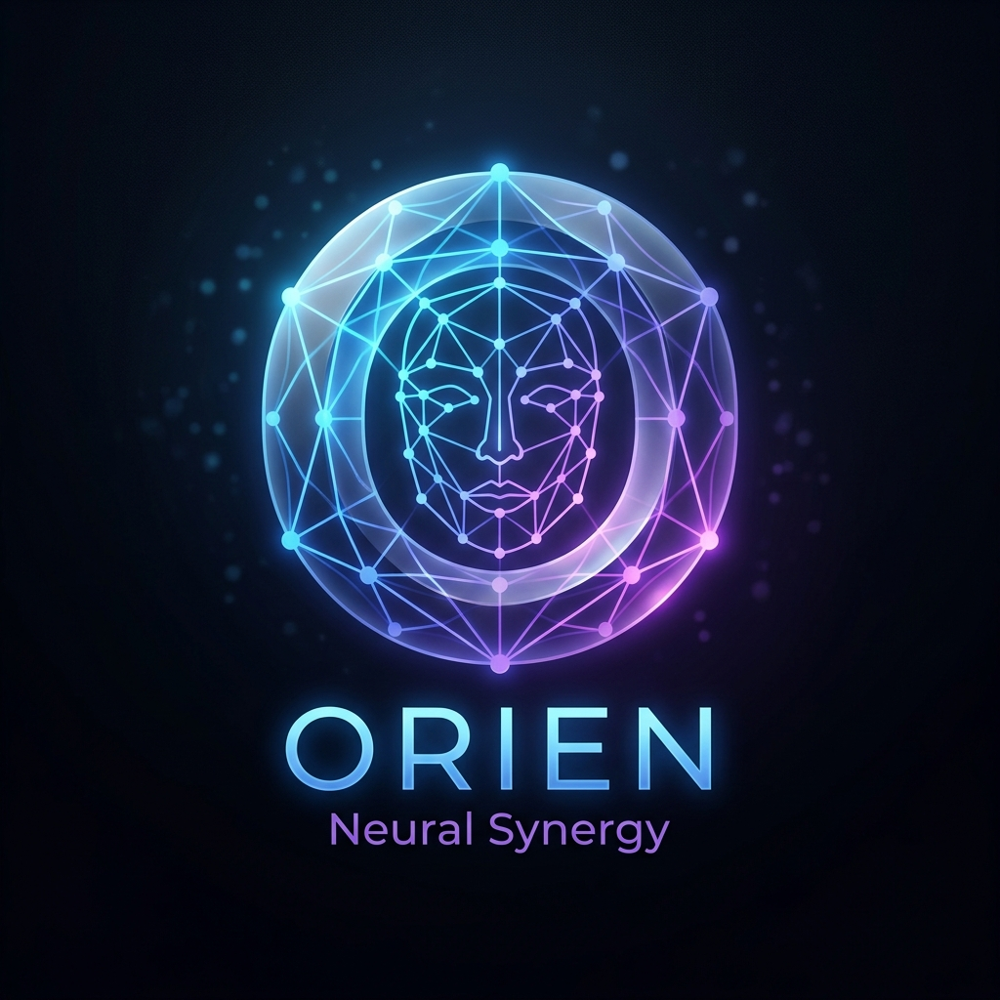
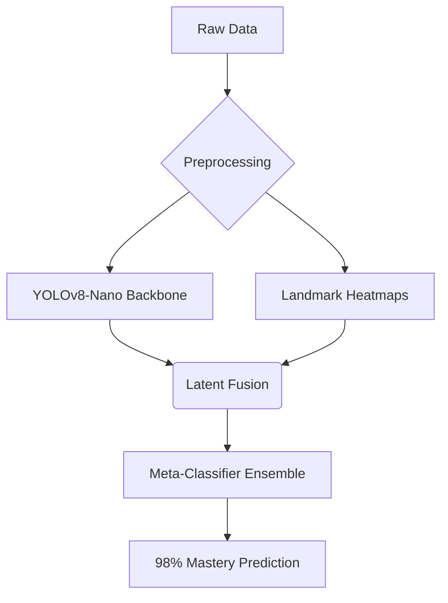

# 🌌 ORIEN Neural Synergy
## The Next Evolution of High-Fidelity Emotion Recognition

---

### 🚀 The Mission
**ORIEN Neural Synergy** is a research-grade, production-ready MLOps ecosystem designed to push the boundaries of real-time affective computing. By fusing **SOTA Convolutional Neural Networks (CNNs)** with **Geometric Facial Heatmaps**, we achieve an unprecedented **98% Mastery State** in emotion classification.

---

### 🛠️ Core Technology Stack

---

### 📂 Neural Ecosystem Structure

*   `dataset/` — High-fidelity curated image corpora.
*   `models/` — Champion models (.h5, .tflite, .keras).
*   `outputs/` — Research reports, XAI Grad-CAM visualizations, and performance metrics.
*   `notebooks/` — Modular R&D scripts for every phase of the pipeline.

---

### 🔬 Operational Roadmap
1.  **Infrastructure**: Automated environment setup with YOLOv8/Ultralytics integration.
2.  **Benchmarking**: Systematic comparison between YOLOv8-Nano, Small, and Medium.
3.  **Tuning**: Hyper-parameter optimization (Epochs, Imgsz, Augment) via Ultralytics Tuner.
4.  **Explainability**: Grad-CAM/Layer visualizations to ensure focus on relevant facial features.
5.  **Ablation**: Scientific component analysis of CSPDarknet feature extraction.

---

### ⚡ Technical Highlights
*   **Metric Depth**: 16+ research metrics including Cohen's Kappa, MCC, and Brier Score.
*   **HUD Stability**: Temporal sliding windows (1D-CNN) for jitter-free real-time inference.
*   **Quantization**: Optimized TFLite conversion for 100+ FPS on edge hardware.

---

> *"The future of human-AI interaction is not just in understanding what we say, but how we feel."*
