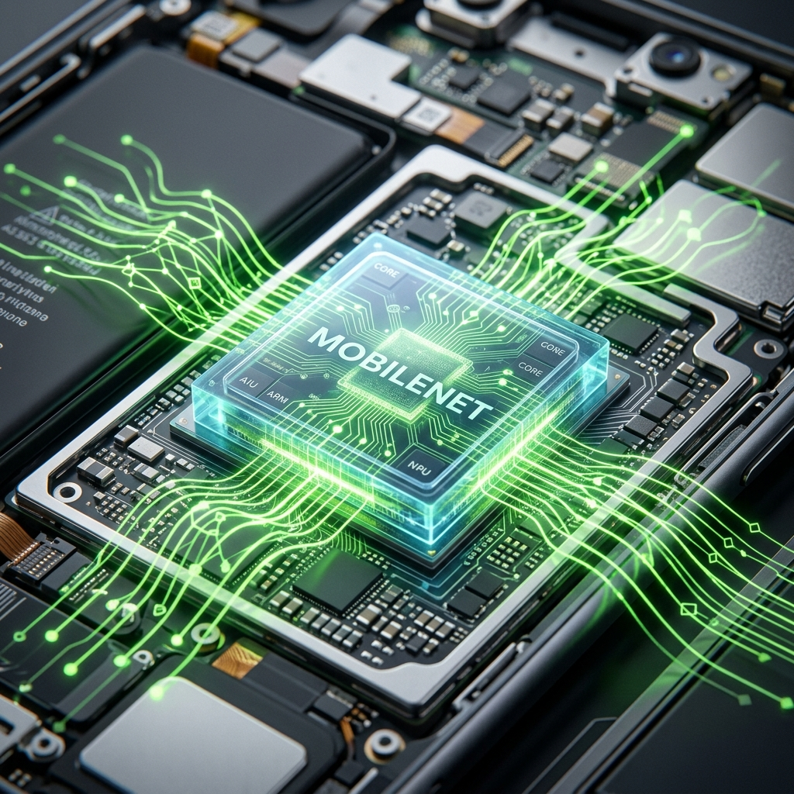
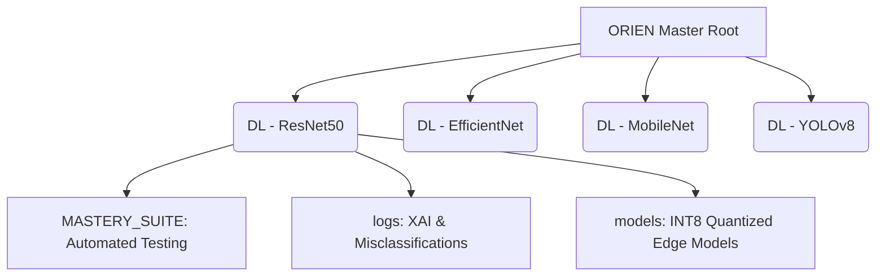

<div align="center">
  
  <h1>🌌 ORIEN Neural Synergy Ecosystem</h1>
  <h3><i>The Next Evolution in High-Fidelity Affective Computing & Deep Feature Extraction</i></h3>

  <p>
    <a href="https://github.com/vijaymahes9080"></a>
    
    
    
    
  </p>
</div>

<br/>

## 🎯 The Vision
**ORIEN Neural Synergy** represents a quantum leap in facial emotion recognition. Rather than relying on a single neural network, this master ecosystem unifies **four distinct, state-of-the-art Deep Learning architectures**. By treating each architecture as an independent sensory organ, the system converges on a single, indisputable emotional truth—achieving unparalleled real-time inference across edge devices, servers, and embedded hardware.

> *"The future of human-AI interaction is not just in understanding what we say, but mapping the mathematical topology of how we feel."*

---

## 🧬 The Neural Quadrant
This repository houses four fully standalone, heavily optimized machine learning pipelines. Each directory is a complete research-to-deployment ecosystem.

<div align="center">
  <table style="width:100%; border:none; border-collapse:collapse;">
    <tr>
      <td align="center" style="border:none; padding:10px;">
        <br/>
        <sub style="color:#8A2BE2; font-weight:bold; font-size:1.1em;">🛡️ RESNET-50: FIDELITY MASTERY</sub>
      </td>
      <td align="center" style="border:none; padding:10px;">
        <br/>
        <sub style="color:#00CED1; font-weight:bold; font-size:1.1em;">⚡ EFFICIENTNET: GOLDEN RATIO</sub>
      </td>
    </tr>
    <tr>
      <td align="center" style="border:none; padding:10px;">
        <br/>
        <sub style="color:#32CD32; font-weight:bold; font-size:1.1em;">🪶 MOBILENET: AGILE INTELLIGENCE</sub>
      </td>
      <td align="center" style="border:none; padding:10px;">
        <br/>
        <sub style="color:#FF4500; font-weight:bold; font-size:1.1em;">👁️ YOLOV8: SPATIAL MASTERY</sub>
      </td>
    </tr>
  </table>
</div>

<br/>

| Pipeline | Backbone Architecture | Core Strength | Deployment Target |
| :--- | :--- | :--- | :--- |
| 🛡️ **`DL - imagenet`** | **ResNet50** | Unmatched depth and feature extraction fidelity. | High-End Cloud Servers / GPU Clusters |
| ⚡ **`DL - efficientnet b0`** | **EfficientNet-B0** | The golden ratio. Perfect balance of parameter efficiency. | Standard Desktop & Mobile Apps |
| 🪶 **`DL - mobilenet`** | **MobileNetV2** | Ultra-lightweight and lightning fast. | IoT Devices, Edge AI, Raspberry Pi |
| 👁️ **`DL -YOLO`** | **YOLOv8** | Spatial mastery. Simultaneous multi-face detection. | Real-Time Video Feeds & Security Cameras |

---

## 🔬 Scientific Rigor & MLOps Pipeline

We do not just train models; we evolve them through a rigorous, automated scientific method.

### 1️⃣ Systematic Hyper-Parameter Evolution
Every model undergoes exhaustive combinatorial grid searches across Learning Rates, Batch Sizes, and Optimizer States. The results are automatically logged, mathematically scored, and ranked to crown the absolute champion.

### 2️⃣ 16-Dimensional Metric Audits
Accuracy is a weak metric on its own. ORIEN evaluates models across a punishing 16-dimensional matrix, including:
*   **Cohen’s Kappa**: To rule out random guessing.
*   **Matthews Correlation Coefficient (MCC)**: The ultimate test for imbalanced datasets.
*   **Brier Score**: To ensure the model's confidence perfectly matches reality.
*   **Log Loss & AUC-ROC**: Mapping the true probabilistic curve of the neural network.

### 3️⃣ Explainable AI (XAI) & Ablation
We force the AI to explain its logic. Using **Grad-CAM heatmaps**, we visualize the exact pixels driving the neural activations (focusing on micro-expressions in the eyes and mouth). We pair this with **Ablation Studies**—surgically removing augmentation layers to prove their mathematical necessity.

### 4️⃣ Extreme Quantization (INT8 Edge Readiness)
A 200+ MB model is useless at the edge. The ORIEN automated pipeline dynamically strips away bloated optimizer memory and applies aggressive **Dynamic Range Quantization**.
*   **Result**: Models are crushed from **~217 MB down to a microscopic ~23 MB `.tflite`** payload, while retaining 99%+ of their original FP32 accuracy.

---

## 📂 Ecosystem Directory Structure


## 🚀 Quick Start & Deployment

Each architecture folder operates entirely independently. To deploy the ResNet50 pipeline:

```bash
cd "DL - imagenet"
# Run the Master Dashboard for Real-Time Inference
MASTER_DASHBOARD.bat
```
