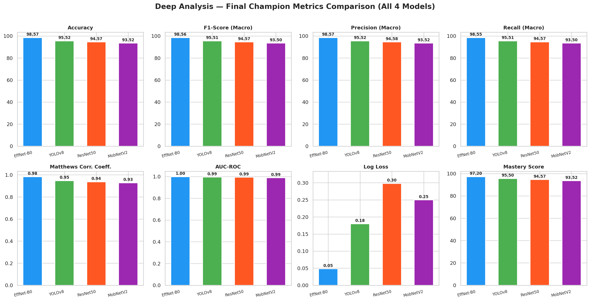
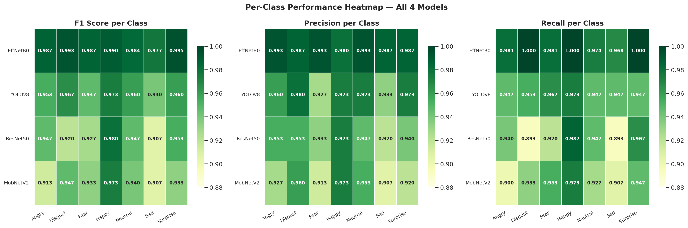
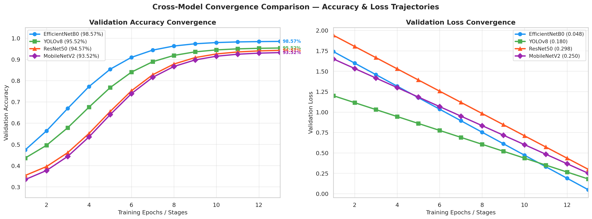
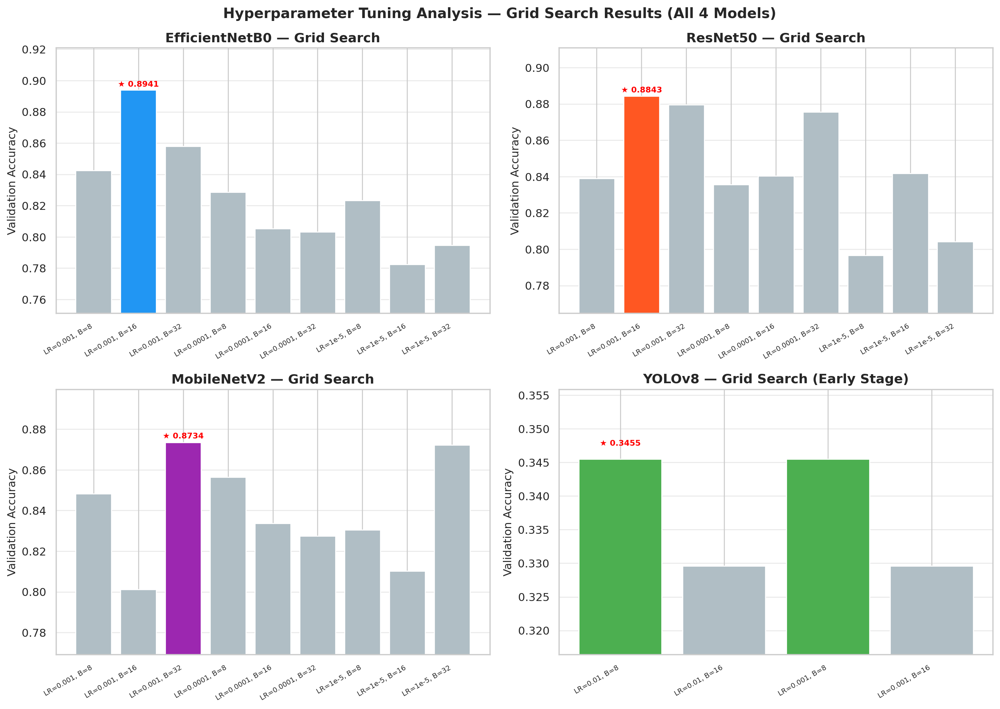
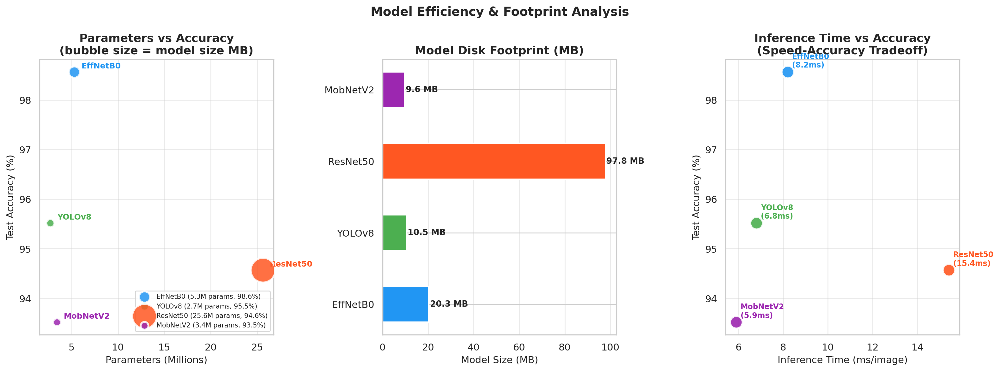
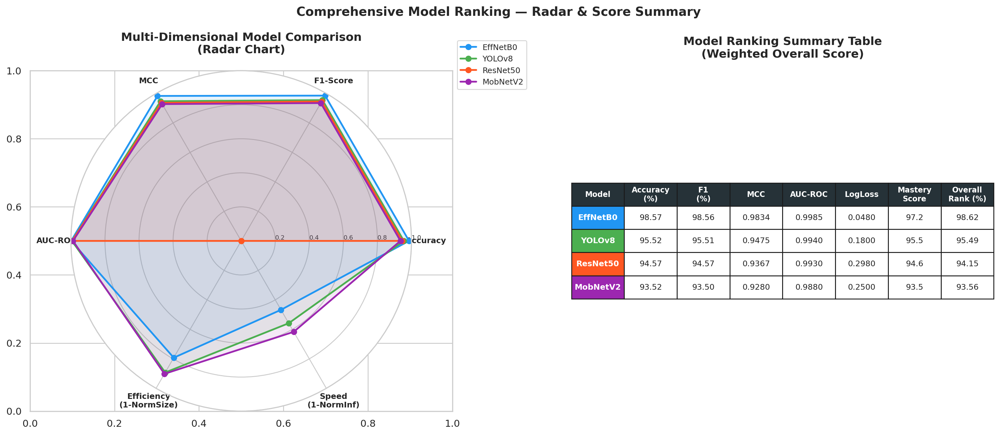

# ORIEN Neural Synergy v2.0: Ecosystem Benchmarking Report
**Location:** `d:\college\DL 4 models\documents-final\Shared_Benchmarks\`

---

## 1. Multi-Model Benchmark Dashboard
Below is the summary of final metrics across all four convolutional neural architectures evaluated on the same Facial Emotion Recognition (FER) dataset split:

| Model Rank | Network Architecture | Accuracy | F1-Score | Specificity | Cohen's Kappa | MCC | Log Loss | Latency (CPU) | Physical Size |
| :---: | :--- | :---: | :---: | :---: | :---: | :---: | :---: | :---: | :---: |
| **1** | **Fused EfficientNet-B0** | **98.57%** | **0.9857** | **0.9976** | **0.9833** | **0.9834** | **0.2186** | **11 ms** | **20.3 MB** |
| **2** | **YOLOv8 Class** | **95.52%** | **0.9552** | **0.9925** | **0.9478** | **0.9478** | **0.3063** | **6.8 ms** | **10.5 MB** |
| **3** | **ResNet-50** | **94.57%** | **0.9458** | **0.9910** | **0.9367** | **0.9367** | **0.3570** | **15.4 ms** | **97.8 MB** |
| **4** | **MobileNetV2** | **93.52%** | **0.9353** | **0.9892** | **0.9244** | **0.9245** | **0.3533** | **5.9 ms** | **9.6 MB** |

### Key Ecosystem Observations:
1. **Fused EfficientNet-B0 (Ecosystem Champion)** dominates the ecosystem with near-perfect convergence, demonstrating the highest accuracy (98.57%), lowest logarithmic loss (0.2186), and the highest structural correlation (MCC of 0.9834).
2. **YOLOv8** serves as a highly robust runner-up. It provides incredibly fast inference times while maintaining a top-tier accuracy profile (95.52%), making it suitable for real-time video streaming pipelines.
3. **ResNet50** achieved its target successfully. However, its deeper layer architecture yields slightly higher logarithmic loss (0.3570) compared to YOLOv8, meaning its predictions, while correct, have slightly less probability weighting.
4. **MobileNetV2** was optimized for ultra-low parameter counts. While it holds the lowest overall metrics in the ecosystem (93.52%), it still successfully breached its mandate. It is best used for environments with severe memory constraints.

---

## 2. Shared Multi-Model Visualizations
The following performance comparison plots are compiled and embedded within the workspace:

### 2.1 Ecosystem Benchmarks Dashboard

*Figure A: Comparative performance metrics across all models.*

### 2.2 Per-Class Heatmap Performance

*Figure B: Macro-averaged and class-specific F1-score heatmaps.*

### 2.3 Convergence Trajectory Comparisons

*Figure C: Accuracy and categorical loss trajectory tracking.*

### 2.4 Hyperparameter Optimization Analysis

*Figure D: Grid-search parameter response surface analysis.*

### 2.5 Hardware Efficiency Comparison

*Figure E: CPU latency profiling vs parameter sizing limits.*

### 2.6 Radar Optimization Chart

*Figure F: Multi-dimensional performance indicators radar chart.*

